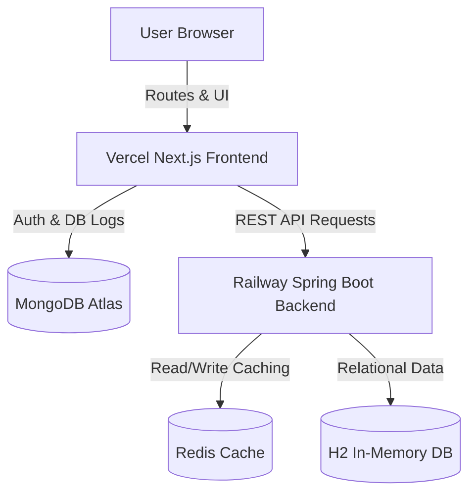
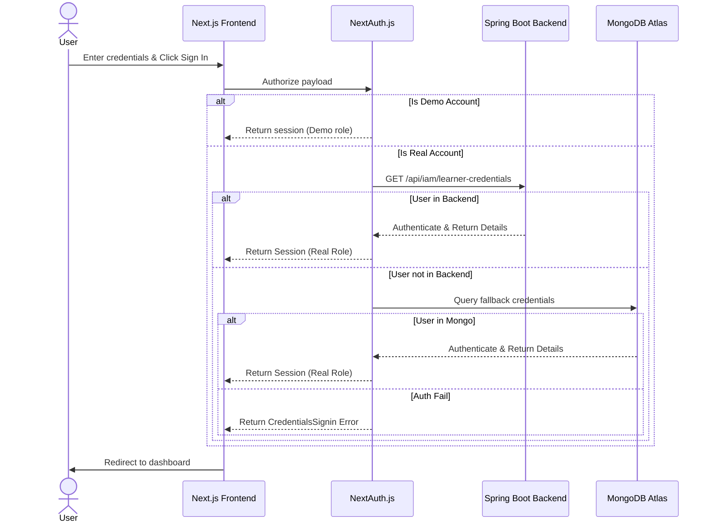
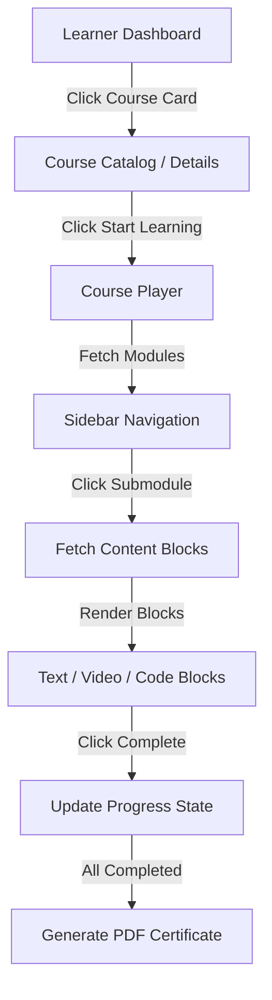
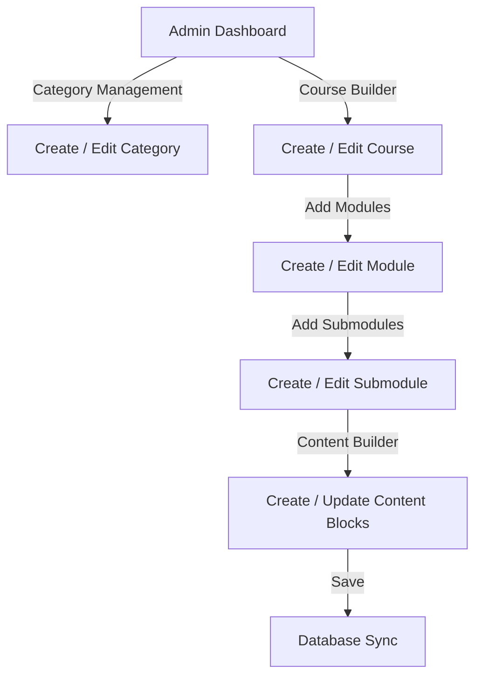
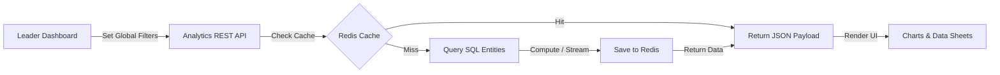

# Xebia LMS Portal Feature Workflows

This document details the step-by-step user flows, frontend/backend integrations, database involvements, and fallback patterns across all 40 systems and features of the **Xebia LMS** portal.

---

## High-Level System Architecture

---

## Diagrams

### 1. Authentication Workflow

### 2. LMS Learning Workflow

### 3. Admin Management Workflow

### 4. Analytics Data Pipeline

---

## Detailed Workflows

### 1. User Authentication
* **Purpose**: Secure sign-in to assign roles and initialize app state.
* **Role**: All Users.
* **Entry Point**: `/signin`
* **Flow**: Input username/email and password -> Submit -> NextAuth interceptor -> Redirect to dashboard.
* **Frontend**: `signin/page.js`
* **Backend**: `/api/iam/learner-credentials` (read validation).
* **Database**: H2 (`User` table) / MongoDB (`credentials` collection).
* **Redis**: None.
* **Success**: Redirected to `/dashboard` with session token.
* **Error**: Displays "Invalid Credentials".

### 2. Demo Learner Login
* **Purpose**: Instant application walkthrough without database constraints.
* **Role**: Guest/Demo Learner.
* **Entry Point**: `/signin`
* **Flow**: Click "Demo Learner" -> Bypass input fields -> NextAuth assigns mock role -> Redirect.
* **Frontend**: `signin/page.js`
* **Backend**: None.
* **Database**: None.
* **Redis**: None.
* **Success**: Redirected to `/dashboard` as `Demo Learner`.
* **Error**: Redirect fails if JS files fail to load.

### 3. Demo Admin Login
* **Purpose**: Instantly preview administrative capabilities.
* **Role**: Guest/Demo Admin.
* **Entry Point**: `/signin`
* **Flow**: Click "Demo Admin" -> Bypass inputs -> NextAuth assigns mock role -> Redirect.
* **Frontend**: `signin/page.js`
* **Backend**: None.
* **Database**: None.
* **Redis**: None.
* **Success**: Redirected to `/admin` as `Demo Admin`.
* **Error**: None.

### 4. Real Learner Login
* **Purpose**: Log in real learners to trace database progression.
* **Role**: Learner.
* **Entry Point**: `/signin`
* **Flow**: Enter credentials (`learner@xebia.com`) -> Submit -> Backend validates -> Redirect.
* **Frontend**: `signin/page.js`
* **Backend**: `/api/iam/learner-credentials`.
* **Database**: H2 (`User` table).
* **Redis**: None.
* **Success**: Redirected to `/dashboard`.
* **Error**: Fails back to localStorage fallback if backend is down.

### 5. Real Admin Login
* **Purpose**: Log in real admins to edit backend curriculum databases.
* **Role**: Admin.
* **Entry Point**: `/signin`
* **Flow**: Enter credentials (`admin@xebia.com`) -> Submit -> Backend validates -> Redirect.
* **Frontend**: `signin/page.js`
* **Backend**: `/api/iam/learner-credentials`.
* **Database**: H2 (`User` table).
* **Redis**: None.
* **Success**: Redirected to `/admin`.
* **Error**: Fallback to local admin simulation.

### 6. Learner Dashboard
* **Purpose**: Overview of registered courses, progress, and recommendations.
* **Role**: Learner.
* **Entry Point**: `/dashboard`
* **Flow**: Load page -> API requests fetch profile status -> Render cards.
* **Frontend**: `dashboard/page.js`
* **Backend**: `/api/courses`, `/api/analytics/recommendations`.
* **Database**: H2 (`Course` table).
* **Redis**: Cached recommendations.
* **Success**: Rendered statistics (Completed courses, hours spent).
* **Error**: Renders fallback/mock cards.

### 7. Admin Dashboard
* **Purpose**: Central controls for learners, curriculum, and global configuration.
* **Role**: Admin.
* **Entry Point**: `/admin`
* **Flow**: Load page -> Validate session -> Fetch management summaries -> Render panels.
* **Frontend**: `admin/page.js`
* **Backend**: `/api/iam/learner-credentials`, `/api/analytics/executive-summary`.
* **Database**: H2 (`User` table).
* **Redis**: Cached summary values.
* **Success**: Displays admin metric counts.
* **Error**: Renders static/empty tables.

### 8. Course Catalog
* **Purpose**: Display all available courses with search and filters.
* **Role**: Learner / Admin.
* **Entry Point**: `/courses`
* **Flow**: Select filters -> Submit query -> Fetch records -> Render list.
* **Frontend**: `courses/page.js`
* **Backend**: `/api/courses?categoryId=...`.
* **Database**: H2 (`Course` table).
* **Redis**: None.
* **Success**: Dynamic grid of courses.
* **Error**: Renders fallback mock list.

### 9. Course Details Page
* **Purpose**: View course curriculum outlines and details.
* **Role**: Learner / Admin.
* **Entry Point**: `/courses/[slug]`
* **Flow**: Click course -> Fetch details & modules -> Display syllabus.
* **Frontend**: `courses/[slug]/page.js`
* **Backend**: `/api/courses/slug/[slug]`, `/api/courses/[courseId]/modules`.
* **Database**: H2 (`Course`, `Module` tables).
* **Redis**: None.
* **Success**: Renders descriptions, levels, durations, and syllabus.
* **Error**: Displays 404 page if course not found.

### 10. Start Learning Flow
* **Purpose**: Entry point to the interactive curriculum reader.
* **Role**: Learner.
* **Entry Point**: `/courses/[slug]` (button click).
* **Flow**: Click "Start Learning" -> Query backend for first module -> Redirect to reader.
* **Frontend**: `courses/[slug]/page.js` (Start button).
* **Backend**: `/api/courses/[courseId]/modules`, `/api/modules/[moduleId]/submodules`.
* **Database**: H2 (`Module`, `Submodule` tables).
* **Redis**: None.
* **Success**: Routes to `/learn/[courseSlug]/[submoduleSlug]`.
* **Error**: Routes to first static page if database is empty.

### 11. Modules Flow
* **Purpose**: Grouping submodules into logical chapters.
* **Role**: Learner.
* **Entry Point**: `/learn/[courseSlug]/[submoduleSlug]` (sidebar).
* **Flow**: Sidebar fetches modules -> Expands current module -> Display submodules.
* **Frontend**: `learn/[courseSlug]/[submoduleSlug]/page.js` (Sidebar Component).
* **Backend**: `/api/courses/[courseId]/modules`.
* **Database**: H2 (`Module` table).
* **Redis**: None.
* **Success**: Syllabus collapsible list renders.
* **Error**: Displays mock chapter structure.

### 12. Submodules Flow
* **Purpose**: Navigation segments representing individual lessons.
* **Role**: Learner.
* **Entry Point**: `/learn/[courseSlug]/[submoduleSlug]` (lesson click).
* **Flow**: Click sidebar item -> Query lesson info -> Fetch content.
* **Frontend**: `learn/[courseSlug]/[submoduleSlug]/page.js`.
* **Backend**: `/api/modules/[moduleId]/submodules`.
* **Database**: H2 (`Submodule` table).
* **Redis**: None.
* **Success**: Loads lesson interface cleanly.
* **Error**: Keeps previous page content.

### 13. Content Viewing Flow
* **Purpose**: Render lessons containing markdown text, videos, and code.
* **Role**: Learner.
* **Entry Point**: `/learn/[courseSlug]/[submoduleSlug]` (main view).
* **Flow**: Fetch content blocks -> Iterate and render customized block modules.
* **Frontend**: `learn/[courseSlug]/[submoduleSlug]/page.js` (Content Renderer).
* **Backend**: `/api/submodules/[submoduleId]/contents`.
* **Database**: H2 (`Content` table).
* **Redis**: None.
* **Success**: Interactive code blocks, video players, and guides render.
* **Error**: Renders a warning message.

### 14. Course Progress Tracking
* **Purpose**: Persist completed submodules.
* **Role**: Learner.
* **Entry Point**: `/learn/[courseSlug]/[submoduleSlug]` (Complete button).
* **Flow**: Click "Complete & Next" -> Send completion event -> Calculate and update progress.
* **Frontend**: `learn/[courseSlug]/[submoduleSlug]/page.js`.
* **Backend**: `/api/progress` (POST).
* **Database**: H2 (`Progress` table).
* **Redis**: None.
* **Success**: Checkmark updates in sidebar; recalculates course completion percentage.
* **Error**: Warns user but proceeds locally.

### 15. Certificate Completion Flow
* **Purpose**: Generate and download PDFs when course progress hits 100%.
* **Role**: Learner.
* **Entry Point**: `/dashboard` (completed certificates tab).
* **Flow**: Click "Download Certificate" -> Generate PDF structure -> Trigger download.
* **Frontend**: `dashboard/page.js` (PDF generator).
* **Backend**: None (client-side generation).
* **Database**: Progress validated from H2/localStorage.
* **Redis**: None.
* **Success**: Downloads PDF containing course name and user details.
* **Error**: Alert error popup.

### 16. Admin Category Management
* **Purpose**: Add, edit, or delete catalog taxonomy headers.
* **Role**: Admin.
* **Entry Point**: `/admin/categories`
* **Flow**: Open panel -> Fill form details -> Save -> Table refresh.
* **Frontend**: `admin/categories/page.js`.
* **Backend**: `/api/categories` (POST/PUT/DELETE).
* **Database**: H2 (`Category` table).
* **Redis**: Evicts cached category lookups.
* **Success**: Category shows up in public listing.
* **Error**: Displays validation warning toast.

### 17. Admin Course Management
* **Purpose**: Curriculum catalog creation.
* **Role**: Admin.
* **Entry Point**: `/admin/courses`
* **Flow**: Create Course -> Fill form -> Attach category -> Save.
* **Frontend**: `admin/courses/page.js`.
* **Backend**: `/api/courses` (POST/PUT/DELETE).
* **Database**: H2 (`Course` table).
* **Redis**: Evicts cached listings.
* **Success**: Course listed in catalog dashboard.
* **Error**: Alert popup with error context.

### 18. Admin Module Management
* **Purpose**: Divide courses into chapters.
* **Role**: Admin.
* **Entry Point**: `/admin/modules`
* **Flow**: Select course -> Create module -> Assign order index -> Save.
* **Frontend**: `admin/modules/page.js`.
* **Backend**: `/api/modules` (POST/PUT/DELETE).
* **Database**: H2 (`Module` table).
* **Redis**: None.
* **Success**: Chapter added to course outline.
* **Error**: None.

### 19. Admin Submodule Management
* **Purpose**: Create lesson frames inside chapters.
* **Role**: Admin.
* **Entry Point**: `/admin/submodules`
* **Flow**: Select module -> Add lesson details -> Save.
* **Frontend**: `admin/submodules/page.js`.
* **Backend**: `/api/submodules` (POST/PUT/DELETE).
* **Database**: H2 (`Submodule` table).
* **Redis**: None.
* **Success**: Lesson shows up in curriculum tree.
* **Error**: Fails validation.

### 20. Content Builder
* **Purpose**: Construct complex interactive content layouts (Code, Video, Text, Callout).
* **Role**: Admin.
* **Entry Point**: `/admin/content`
* **Flow**: Select lesson -> Choose block type -> Input block fields -> Save.
* **Frontend**: `admin/content/page.js`.
* **Backend**: `/api/contents` (POST/PUT/DELETE).
* **Database**: H2 (`Content` table).
* **Redis**: None.
* **Success**: Dynamic elements persist inside the lesson.
* **Error**: Format parsing failures trigger toasts.

### 21. Curriculum Analytics Dashboard
* **Purpose**: Overview of course feedback and user retention metrics.
* **Role**: Admin / Executive.
* **Entry Point**: `/admin/analytics`
* **Flow**: Read summaries -> View chart bars -> Sort distributions.
* **Frontend**: `admin/analytics/page.js`.
* **Backend**: `/api/analytics/executive-summary`, `/api/analytics/learning-trends`.
* **Database**: H2 (`Session`, `Nomination` tables).
* **Redis**: Cached JSON logs.
* **Success**: Graphs render successfully.
* **Error**: Reverts to mock analytics graphs.

### 22. Leadership Analytics Dashboard
* **Purpose**: Strategic view of corporate training, AI upskilling, and business unit investments.
* **Role**: Executive.
* **Entry Point**: `/admin/leadership-analytics`
* **Flow**: Set global filters -> Query metrics -> Render panels and export data sheets.
* **Frontend**: `admin/leadership-analytics/page.js`.
* **Backend**: `/api/analytics/*` (All 15 endpoints).
* **Database**: H2 (`Employee`, `Training`, `Session`, `Nomination`, `Certification`, `AIUsage`, `FresherApprentice`).
* **Redis**: Key caching per global filter combination.
* **Success**: Complete visualization grids render.
* **Error**: Alerts the user and switches to simulated model.

### 23. Executive Summary Analytics
* **Purpose**: Main KPIs (Trained count, feedback averages, AI upskilling coverage).
* **Role**: Executive / Admin.
* **Entry Point**: `/admin/leadership-analytics` (top section).
* **Flow**: Load page -> Query endpoint with filters -> Return key values.
* **Frontend**: `admin/leadership-analytics/page.js` -> `executiveSummary`.
* **Backend**: `/api/analytics/executive-summary`.
* **Database**: H2 (`Employee`, `Session` tables).
* **Redis**: Cached response.
* **Success**: Renders main top KPI cards.
* **Error**: Fails back to simulated summary scores.

### 24. Learning Coverage Analytics
* **Purpose**: Track target trained percentages vs. actual progress.
* **Role**: Executive.
* **Entry Point**: `/admin/leadership-analytics` -> Coverage panel.
* **Flow**: Fetch coverage -> Compare business unit parameters -> Render gauge charts.
* **Frontend**: `admin/leadership-analytics/page.js` -> `learningCoverage`.
* **Backend**: `/api/analytics/learning-coverage`.
* **Database**: H2 (`Employee`, `Nomination` tables).
* **Redis**: Cached.
* **Success**: Gauges reflect accurate corporate coverage.
* **Error**: Displays static default percentages.

### 25. Learning Hours Analytics
* **Purpose**: Calculate time spent in training segments.
* **Role**: Executive.
* **Entry Point**: `/admin/leadership-analytics` -> Hours spent component.
* **Flow**: Query hours -> Group by BUs -> Render bar charts.
* **Frontend**: `admin/leadership-analytics/page.js` -> `learningHours`.
* **Backend**: `/api/analytics/learning-hours`.
* **Database**: H2 (`Session` table).
* **Redis**: Cached.
* **Success**: Interactive bar chart reflects time logs.
* **Error**: Fallback to default mocks.

### 26. AI Transformation Dashboard
* **Purpose**: Track GenAI upskilling progress and tool adoption metrics.
* **Role**: Executive.
* **Entry Point**: `/admin/leadership-analytics` -> AI Transformation Tab.
* **Flow**: Query AI statistics -> Count certified users -> Render metrics.
* **Frontend**: `admin/leadership-analytics/page.js` -> `aiTransformation`.
* **Backend**: `/api/analytics/ai-transformation`.
* **Database**: H2 (`AIUsage`, `Training` tables).
* **Redis**: Cached.
* **Success**: Renders adoption charts.
* **Error**: Fails back to simulated metrics.

### 27. Certification Dashboard
* **Purpose**: Track completed corporate technology certifications.
* **Role**: Executive.
* **Entry Point**: `/admin/leadership-analytics` -> Certifications Tab.
* **Flow**: Fetch completions -> Group by provider -> Render charts.
* **Frontend**: `admin/leadership-analytics/page.js` -> `certifications`.
* **Backend**: `/api/analytics/certifications`.
* **Database**: H2 (`Certification` table).
* **Redis**: Cached.
* **Success**: Certification list and chart render successfully.
* **Error**: Shows mock certification counts.

### 28. Flagship Program Dashboard
* **Purpose**: Performance tracking of main internal programs.
* **Role**: Executive.
* **Entry Point**: `/admin/leadership-analytics` -> Programs Tab.
* **Flow**: Fetch program scores -> Compare target parameters -> Render table.
* **Frontend**: `admin/leadership-analytics/page.js` -> `flagshipPrograms`.
* **Backend**: `/api/analytics/flagship-programs`.
* **Database**: H2 (`Training` table).
* **Redis**: Cached.
* **Success**: Detailed flagship program tracking lists display.
* **Error**: Table loads fallback entries.

### 29. Learning Trends Dashboard
* **Purpose**: Chronological aggregation of learning engagement.
* **Role**: Executive / Admin.
* **Entry Point**: `/admin/leadership-analytics` -> Trends Tab.
* **Flow**: Fetch time series -> Map monthly trends -> Render spline graphs.
* **Frontend**: `admin/leadership-analytics/page.js` -> `learningTrends`.
* **Backend**: `/api/analytics/learning-trends`.
* **Database**: H2 (`Session` table).
* **Redis**: Cached.
* **Success**: Spline line chart displays monthly progress.
* **Error**: Fallback to flat mock lines.

### 30. Training Effectiveness Dashboard
* **Purpose**: Evaluate training outcomes and feedback scores.
* **Role**: Executive.
* **Entry Point**: `/admin/leadership-analytics` -> Effectiveness Tab.
* **Flow**: Fetch scores -> Compare ratings -> Render scatter plots.
* **Frontend**: `admin/leadership-analytics/page.js` -> `trainingEffectiveness`.
* **Backend**: `/api/analytics/training-effectiveness`.
* **Database**: H2 (`Training` table).
* **Redis**: Cached.
* **Success**: Renders feedback grids.
* **Error**: Reverts to mock ratings.

### 31. Learning Champions Dashboard
* **Purpose**: Recognize employees with the highest learning hours.
* **Role**: Executive / Admin.
* **Entry Point**: `/admin/leadership-analytics` -> Leaderboard.
* **Flow**: Query leaderboard -> Pick top performers -> Render table.
* **Frontend**: `admin/leadership-analytics/page.js` -> `learningChampions`.
* **Backend**: `/api/analytics/learning-champions`.
* **Database**: H2 (`Employee`, `Session` tables).
* **Redis**: Cached.
* **Success**: Renders leaderboard list.
* **Error**: Reverts to mock names.

### 32. Project Learning Investment Dashboard
* **Purpose**: Align training hours with client project allocations.
* **Role**: Executive.
* **Entry Point**: `/admin/leadership-analytics` -> Investment.
* **Flow**: Query investment -> Group by project -> Render charts.
* **Frontend**: `admin/leadership-analytics/page.js` -> `projectInvestment`.
* **Backend**: `/api/analytics/project-investment`.
* **Database**: H2 (`Employee`, `Session` tables).
* **Redis**: Cached.
* **Success**: Renders breakdown lists.
* **Error**: Empty/default listings.

### 33. Fresher/Apprentice Journey Dashboard
* **Purpose**: Track bootcamp upskilling timelines.
* **Role**: Executive.
* **Entry Point**: `/admin/leadership-analytics` -> Apprenticeship.
* **Flow**: Query freshers -> Calculate deployment times -> Render stats.
* **Frontend**: `admin/leadership-analytics/page.js` -> `fresherJourney`.
* **Backend**: `/api/analytics/fresher-journey`.
* **Database**: H2 (`FresherApprentice` table).
* **Redis**: Cached.
* **Success**: Time-to-deployment progress bars render.
* **Error**: Mock list values display.

### 34. Redis Caching Workflow
* **Purpose**: Optimize high-frequency analytics database reads.
* **Role**: System.
* **Entry Point**: Auto-triggered inside `AnalyticsService.java`.
* **Flow**: Check Redis -> Return cached value if hit; query H2 on miss -> Save to cache -> Return value.
* **Frontend**: None.
* **Backend**: `RedisCacheService.java`.
* **Database**: None.
* **Redis**: Read/Write operations on hits/misses.
* **Success**: Cache operations execute in <5ms.
* **Error**: Gracefully falls back to direct database reads if Redis is down.

### 35. MongoDB Data Workflow
* **Purpose**: Persist user session structures and custom log events.
* **Role**: System.
* **Entry Point**: NextAuth endpoints.
* **Flow**: NextAuth checks credentials -> Query MongoDB -> Set session token.
* **Frontend**: `api/auth/[...nextauth]`
* **Backend**: None.
* **Database**: MongoDB Atlas (`credentials` collection).
* **Redis**: None.
* **Success**: User session initializes cleanly.
* **Error**: Fallback to local storage credential resolution.

### 36. H2 Backend Data Workflow
* **Purpose**: Core application data persistence (Curriculum + Analytics).
* **Role**: System.
* **Entry Point**: Auto-initialized on backend container startup.
* **Flow**: Compile JPA schemas -> Seed default users and records -> Enable controllers.
* **Frontend**: None.
* **Backend**: Spring Boot JPA.
* **Database**: H2 memory-mode (`lmsdb`).
* **Redis**: Cache invalidation targets on data updates.
* **Success**: Database boots in under 1 second.
* **Error**: Falls back to mock structures.

### 37. Frontend-Backend API Workflow
* **Purpose**: Transfer data between client browser and cloud backend.
* **Role**: System.
* **Entry Point**: `src/services/api.js`.
* **Flow**: Assemble query parameters -> Call `fetch()` with CORS origins -> Map output -> React render.
* **Frontend**: `src/services/api.js`.
* **Backend**: Spring Boot REST Controllers.
* **Database**: None.
* **Redis**: None.
* **Success**: HTTP 200 responses with JSON payload.
* **Error**: Fallback to local mock data.

### 38. Demo Fallback Workflow
* **Purpose**: Activate fallback simulation mode if demo profile is active.
* **Role**: System.
* **Entry Point**: `src/services/api.js` (request interceptor).
* **Flow**: Check `LMS_DATA_MODE` -> If `"DEMO_MODE"`, bypass network calls -> Load mockData.
* **Frontend**: `src/services/api.js`.
* **Backend**: None.
* **Database**: `mockData.js`.
* **Redis**: None.
* **Success**: Application remains responsive without hitting backend.
* **Error**: None.

### 39. Backend Failure Fallback Workflow
* **Purpose**: Handle backend connection drops gracefully.
* **Role**: System.
* **Entry Point**: `src/services/api.js` (`catch` block).
* **Flow**: Attempt API call -> Call fails -> Set `isBackendOffline = true` -> Resolve via localStorage.
* **Frontend**: `src/services/api.js` (`request()`).
* **Backend**: None.
* **Database**: `dbClient.js` (IndexedDB / LocalStorage fallback).
* **Redis**: None.
* **Success**: User UI stays alive with offline indicator warnings.
* **Error**: Empty/unresponsive UI states (rare).

### 40. Deployment Workflow (Vercel & Railway)
* **Purpose**: Cloud build pipelines for frontend and backend.
* **Role**: Developer.
* **Entry Point**: Git commit and push (`main` branch).
* **Flow**: Push code -> Railway builds Docker container from `/backend` -> Vercel compiles Next.js frontend -> Deploy.
* **Frontend**: Vercel Git integration.
* **Backend**: Railway build agents.
* **Database**: Schemas automatically rebuilt.
* **Redis**: Reconnected.
* **Success**: Frontend and backend are synced and live.
* **Error**: Build logs highlight syntax or environment errors.
